# Task 4.1 Report
## Networking basics
### Topology 1
Create scheme which contains 4 PC-PT type computers and hub. Each computer should be connected to hub via copper straight-through cable

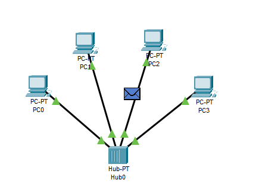

Assign IP-Addresses to PC's

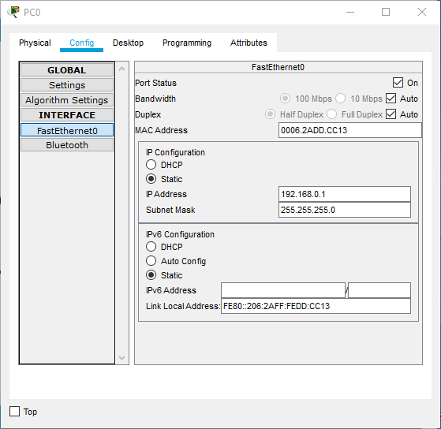

Use simulation panel to track packet route

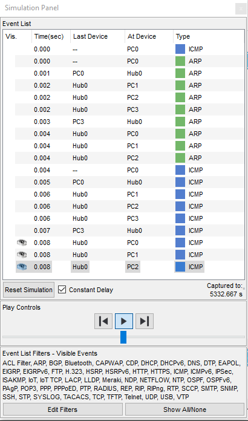

It's working!

Delete IP-addresses and try track packet route again

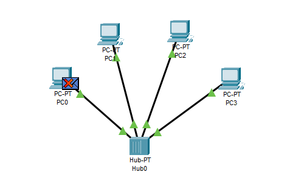

It doesn't work :(

We also can see additional information about PDU by clicking on packet in Event Log

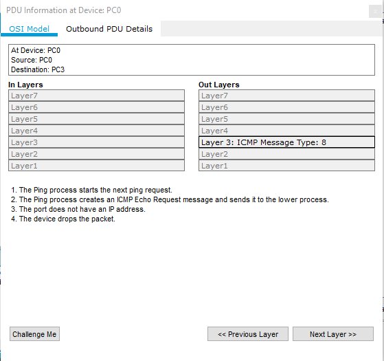
### Topology 2
Create scheme which contains 2 hubs, 6 PC's and 1 server

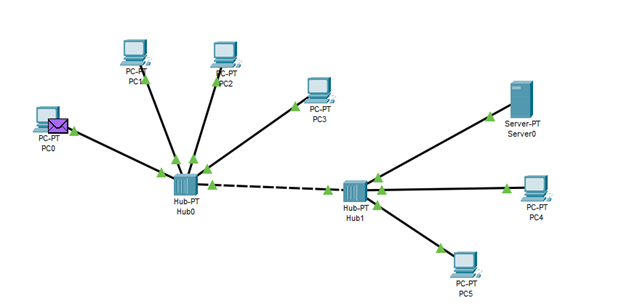

Addresses assigned according to next table:

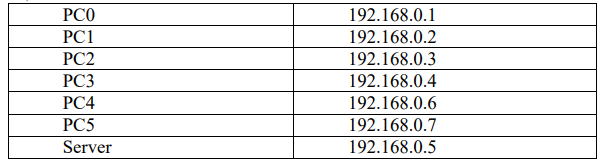

Lets check network health via Simulation Mode

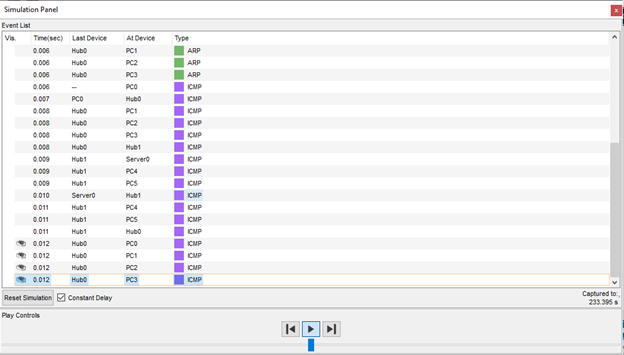
### Topology 3
Create scheme with 4 PC's and switch and check it's workability

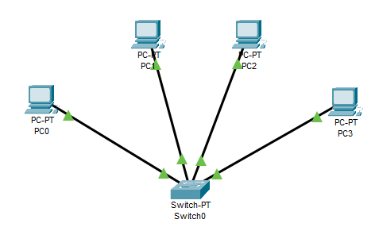

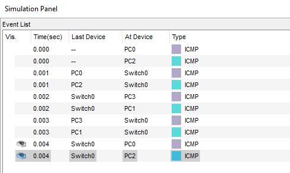

Main difference between topology 1 and topology 3 is basically different network devices.
Topology 1 and 2 using hubs, while topology 3 using switch.
Switch allows multiple PC’s  communicate with each other at the same time. 
When we using hubs, and when connection between 2 PC’s established, other computers can’t communicate with each other.
### Topology 4
Create scheme with 8 PC's and 2 switches. Check network workability

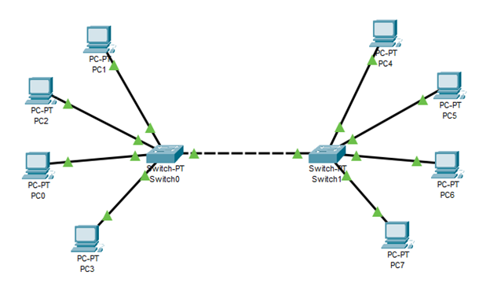

IP-addresses assigned according to table:

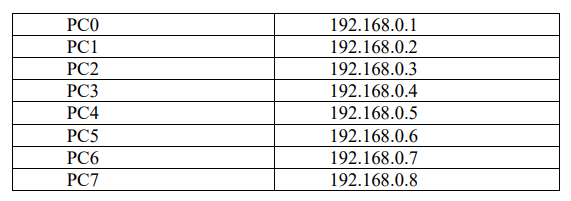 

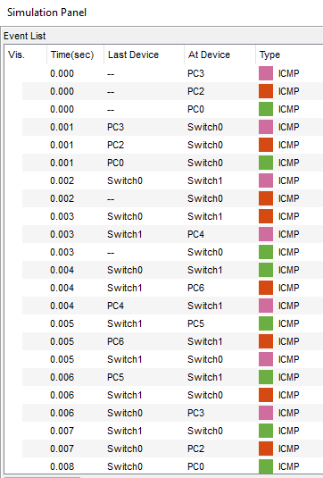
### Topology 5
It's a modified topology 4 with router

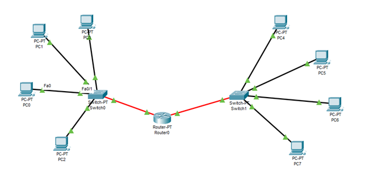

Assigned IP-addresses according to table:

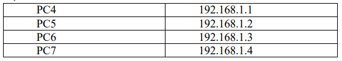

We divided our network on two subnetworks
Let's assign gateways to PC's, so the can communicate with each other

Gateway for 192.168.0.0 network is 192.168.0.5

Gateway for 192.168.1.0 network is 192.168.1.5

Let's add simple PDU to see if it works properly

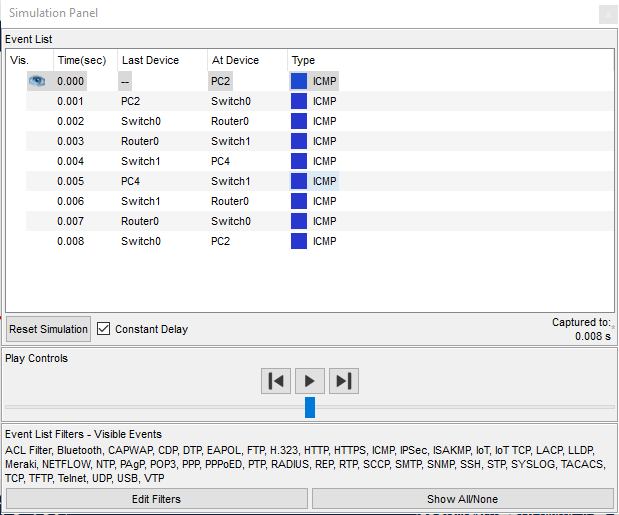

Success!
