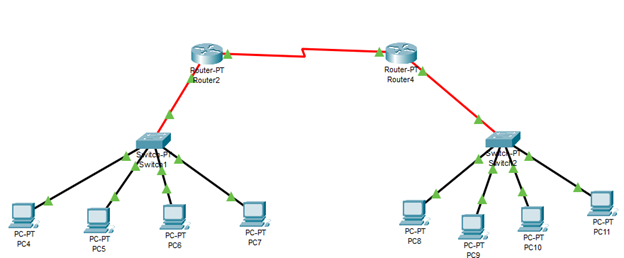
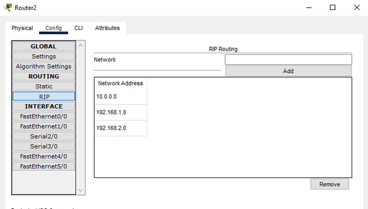
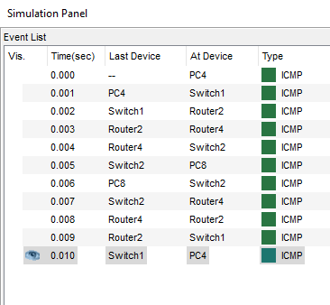

# Task 4.3 Report
## Routing information protocol
I’ve built custom network to set up RIP routing and figure out how it works.

We have 2 networks:
* 192.168.1.1-4 with gateway 192.168.1.5
* 192.168.2.1-4 with gateway 192.168.2.5

Router 2 and 4 connected with each other via serial ports with addresses: 
* 10.0.0.1
* 10.0.0.2

RIP Settings on both routers are the same:

Let's ping from PC4 to PC8 to see if it works properly

## Results
RIP Pros:
* RIP is great for small networks and is easy to understand and configure

* RIP routing is guaranteed to support nearly all routers

* RIP does not need to be updated every time the network topology changes

RIP Cons:
* RIP can create a traffic bottleneck as it broadcasts its updates every 30 seconds. Any RIP routing upgrade requires a lot of bandwidth, and resources for critical IT processes are limited

* RIP hops are limited to 15 hops, so any router outside this distance is considered infinite and unreachable

* Convergence rate is low. When any connection is lost, it takes a long time to select alternative routes

* RIP does not support multiple paths on the same route. When using fixed hop metrics to determine the best routes, RIP does not work when routes are compared based on real-time data. This causes packet loss and congestion on network operations due to repetitive processes

