# Task 5.1 Report
## Part 1
### 1.1 Users and passwd basics
I used `sudo su` to log in as root


`passwd` command changes /etc/passwd and /etc/shadow system files

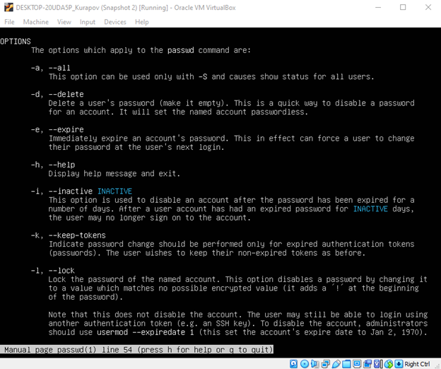

Let's analyze the content of /etc/passwd file


1. andriikurapov: username;
2. x: place for password information; the password can be found in the / etc / shadow file.
3. 1000: User ID. Each user has a unique identifier, thanks to which the system recognizes him. The root user ID is always 0;
4. 1000: group ID. Each group has a unique identifier. By default, each user has a main group. Again, the root group ID is always 0;
5. Andrii: field for notes. This field can be used to describe the user or his functions. It can contain anything from the user's contact information to a description of the services for which the account was created;
6. /home/andriikurapov: home directory. For normal users, the home directory is / home / username; for the root user, it is / root;
7. / bin / bash: user's shell. This field contains the shell that will be created or the commands that will be executed when the user logs on.


Let's change personal information about our currently active user

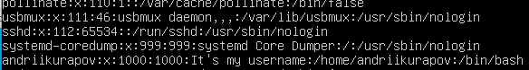
### 1.3 Man and help basics
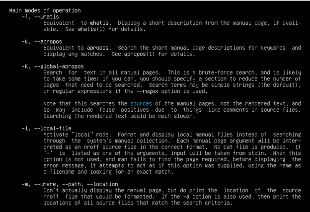

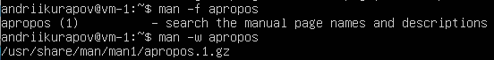

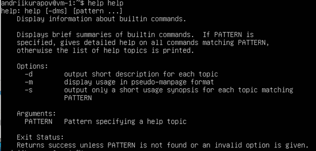

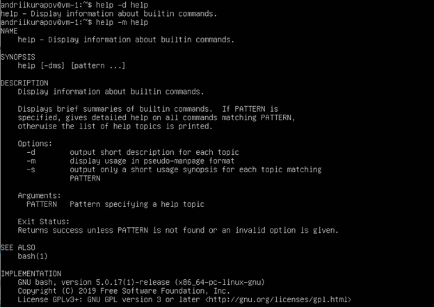

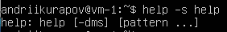
### 1.4 More and less
`more` and `less` commands can be helpful when browsing large text files or in case when command output is too big
Let's browse all .bash* files

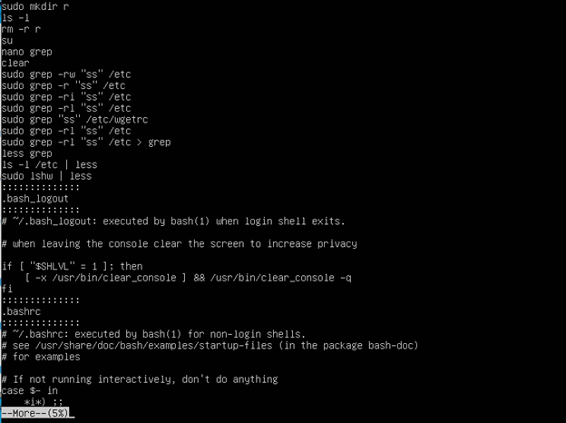

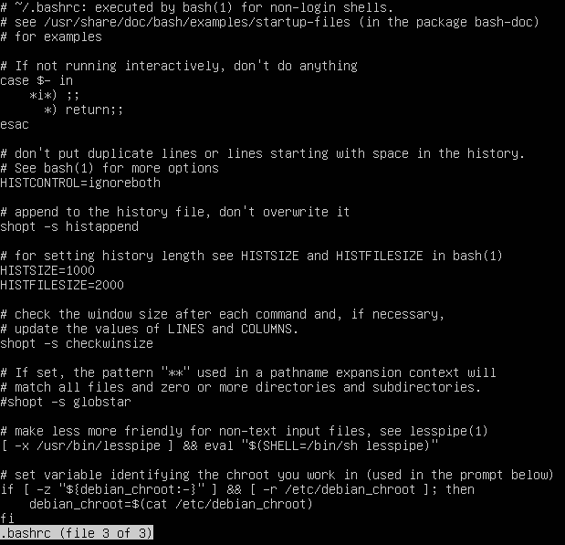

`less` is much comfortable 'cause we can browse files up and down with arrows and switch between files using :n and :p
## Part 2
### 2.1 Tree
Examine the tree command. Master the technique of applying a template, for
example, display all files that contain a character c, or files that contain a
specific sequence of characters. List subdirectories of the root directory up to
and including the second nesting level.

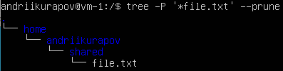

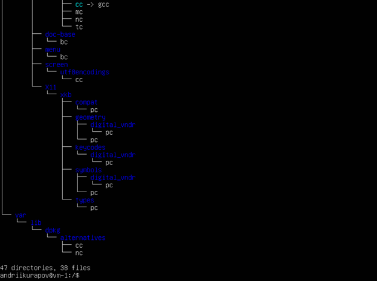

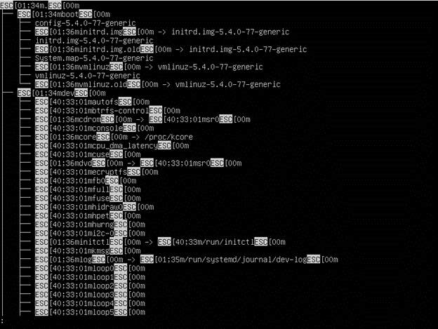
### 2.2 File
We can find out file type with `file` command

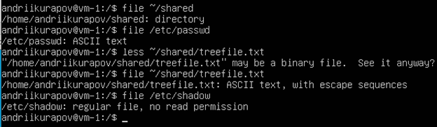
### 2.3 Relative and absolute paths
Relative path navigation example


Absolute path navigation example

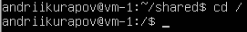

We can change directory to home directory from anywhere using `cd ~`
### 2.4 LS
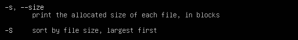

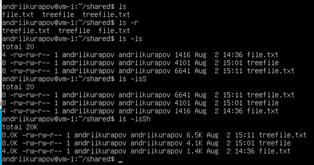 

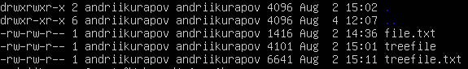

ls -l output 

1. first letter defines file type (‘d’ – directory, ‘-‘ - usual file)
2. rwxrwxrwx – access permissions (user, group, other)
3. number of hard links
4. owner username
5. owner group
6. File size in bytes
7. Date
8. File name
### 2.5 Practice with files
Perform the following sequence of operations:
- create a subdirectory in the home directory;
- in this subdirectory create a file containing information about directories
located in the root directory (using I/O redirection operations);
- view the created file;
- copy the created file to your home directory using relative and absolute
addressing.
- delete the previously created subdirectory with the file requesting removal;
- delete the file copied to the home directory.

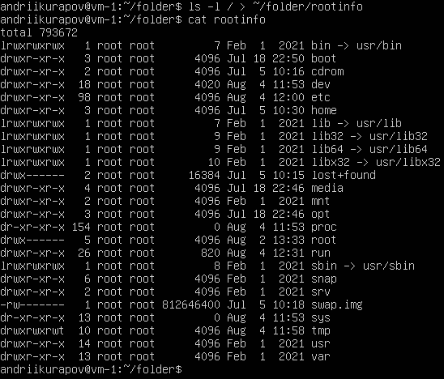

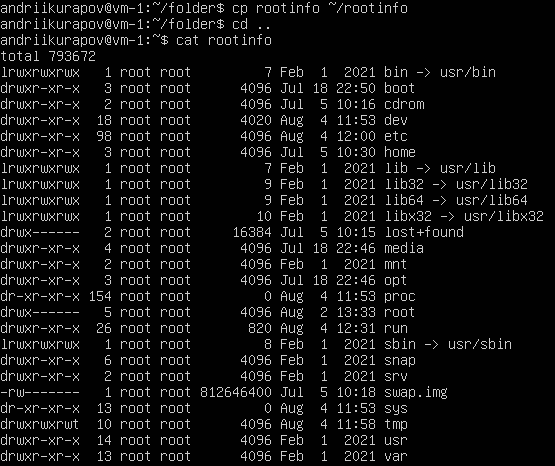

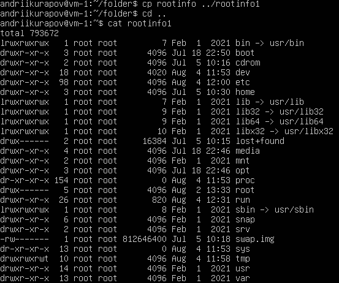

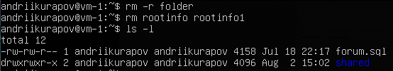
### 2.6 Practice with links
Perform the following sequence of operations:
- create a subdirectory test in the home directory;
- copy the .bash_history file to this directory while changing its name to
labwork2;
- create a hard and soft link to the labwork2 file in the test subdirectory;
- how to define soft and hard link, what do these
concepts;
- change the data by opening a symbolic link. What changes will happen and
why
- rename the hard link file to hard_lnk_labwork2;
- rename the soft link file to symb_lnk_labwork2 file;
- then delete the labwork2. What changes have occurred and why?

To create links i used:
```
ln labwork2 lablink1
ln -s labwork2 symlablink
```

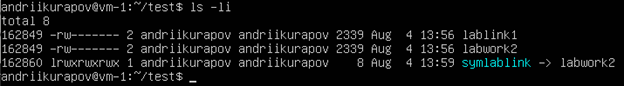

A hard link is basically a copy of the file it refers to, while a soft link contains only its name

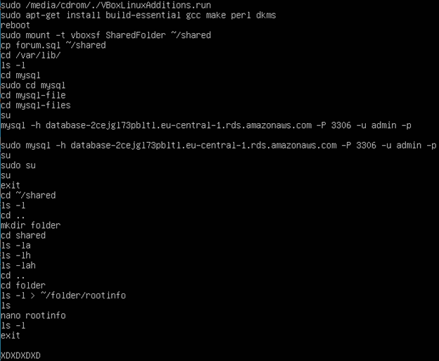

labwork2 and lablink1 changed, because symlink refers to labwork2

Let's rename links according to task and delete labwork2 file

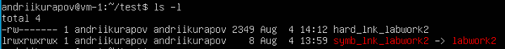


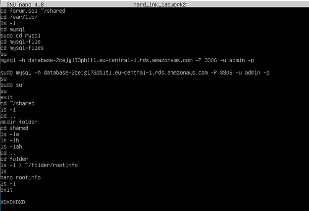

Soft link doesn’t work because related file was deleted, while hard link content left untouched

### 2.7 Locate
Using the locate utility, find all files that contain the squid and traceroute
sequence.

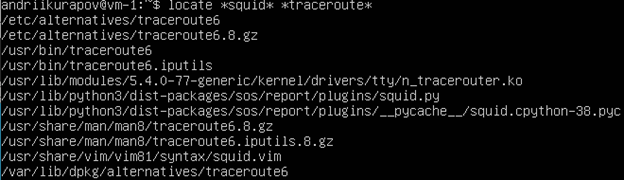
### 2.8 Partitions information
Determine which partitions are mounted in the system, as well as the types of
these partitions

I used `fdisk -l` command

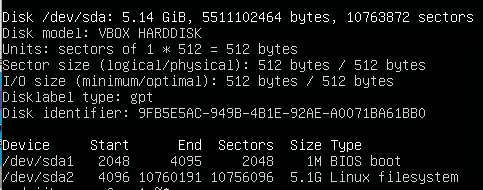
### 2.9 Count the number of lines containing a given sequence of characters in a given file
I tried to use `grep user /etc/passwd | wc -l`

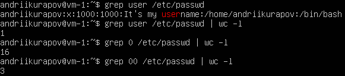
### 2.10 Find basics
Using the find command, find all files in the /etc directory containing the
host character sequence
`find /etc -maxdepth 1 -name "*host*"

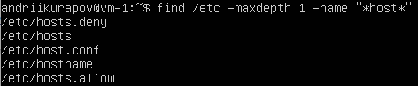
### 2.11 List all objects in /etc that contain the ss character sequence
`sudo grep -rl "ss" /etc`

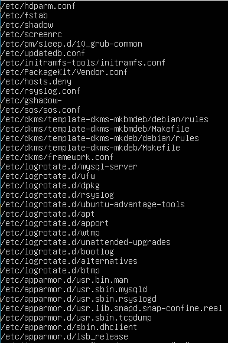
### 2.12 Organize a screen-by-screen print of the contents of the /etc directory
`ls -l /etc | less`

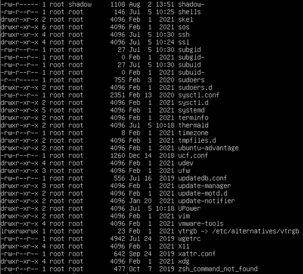
### 2.13 What are the types of devices and how to determine the type of device?
Main commands for hardware management is:
- lspci (PCI Devices)
- lsusb (USB Devices)
- lscpu (CPU Information)
- lsscsi (SCSI Devices)
- lshw (Hardware)
- lsblk (Block Devices) 
We can use lshw to see all the devices types in our vm

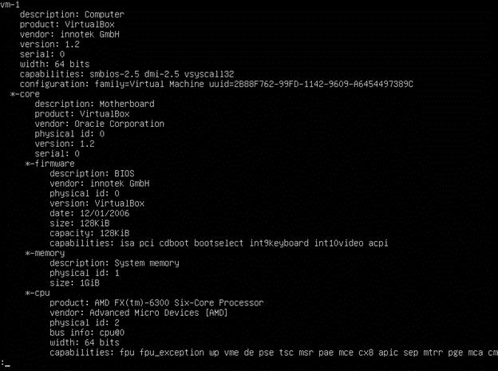
### 2.14 How to determine the type of file in the system, what types of files are there?
I can define the file type by using ls -l output or file utility
Unix file types:
* Regular File – file with some information in it
* Directory - the most common special file. The layout of a directory file is defined by the filesystem used. As several filesystems are available under Unix, both native and non-native, 
there is no one directory file layout
* Symbolic link - a reference to another file. This special file is stored as a textual representation of the referenced file's path 
(which means the destination may be a relative path, or may not exist at all).
* Named Pipe - one of the strengths of Unix has always been inter-process communication. Among the facilities provided by the OS are pipes, which connect the output of one process 
to the input of another. 
* Socket - special file used for inter-process communication, which enables communication between two processes. In addition to sending data, processes can send file descriptors 
across a Unix domain socket connection using the `sendmsg()` and `recvmsg()` system calls.
* Device file - In Unix, almost all things are handled as files and have a location in the file system, even hardware devices like hard drives. The great exception is network devices, 
which do not turn up in the file system but are handled separately.


