# Task 1.1 report

## Step 1: Install GIT on your workstation
I've downloaded GIT bash for Windows by the following [link](https://git-scm.com/downloads) 
## Step 2: Setup git: change yout global configs (add name and e-mail, setup core text editor)
To do this step, i used next commands: 
```
$ git config --global user.name AndriiKurapov
$ git config --global user.email andreykawwee@gmail.com
$ git config --global core.editor nano
```
Let's see if it worked

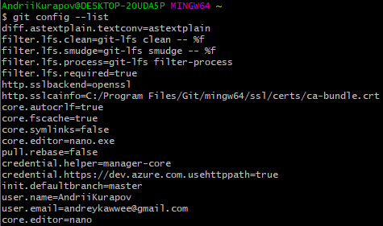
## Step 6: Clone repo to your workstation
In order to clone a remote repository, I copied repo URL and used `git clone` command
`$ git clone https://github.com/AndriiKurapov/DevOps_Online_Kharkiv_2021Q3.git`
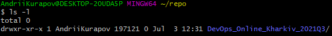

Also, i've made a repository structure according to example in Step 5
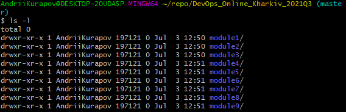
## Step 9-10: Create empty readme.txt file and make init commit
I've used the following commands:
```
touch readme.txt
git add readme.txt
git commit
```

## Step 11-12: Create develop branch and checkout on it, create index.html empty file. Commit
I've used following commands:
```
git branch develop
git checkout develop
touch index.html
git add index.html
git commit
```
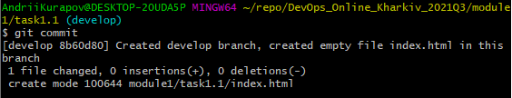
## Step 13: Create branch with name “images”. Checkout on it. Add images folder with some images inside it. Commit.
I've used `git branch` and `git checkout` commands from previous steps, created 'images' folder and used `wget -O` to download images via URL
```
wget -O photo1 https://habrastorage.org/webt/bc/fc/0o/bcfc0omp0773ocss_qpjnhprjym.png
wget -O photo2 https://habrastorage.org/webt/bg/bc/dc/bgbcdchu-v2prvclqs0bnf01jh4.png
```
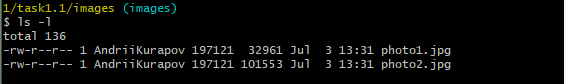
## Step 14: Change your "index.html". Add image source inside it. Commit
I've opened index.html file in nano editor and made next changes:
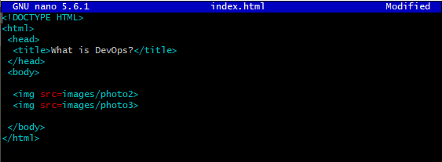
## Step 16: Create branch with name "styles. Checkout on it. Add "styles" folder with styles sources inside it. Commit.
I've used `git branch` and `git checkout` commands from previous steps, created "styles" folder and styles.css file, and filled it.
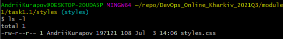
## Step 17: Change your index.html. Commit
I've opened index.html file and changed it

## Step 19-21: Merge two new branches into develop using git merge command. Resolve confict if it appear. Merge develop into master
I've used next commands:
```
git merge images
git merge styles 
```
Confict appeared after merging styles into develop

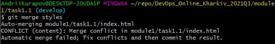

I used `git status` to see, what could be reason of it

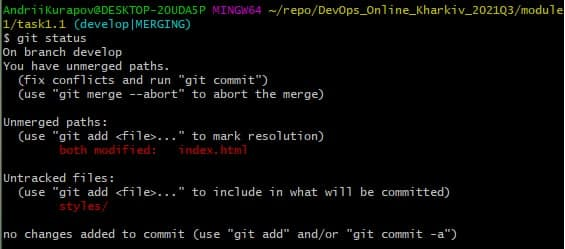

After that i opened index.html

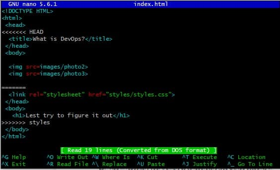

File was messed up so i fixed it 


## Step 24-26: Git reflog
We should execute commands:
```
git reflog > ~/task1.1_GIT_.txt 
mv ~/repo/DevOps_Online_Kharkiv_2021Q3/module1/task1.1
git add task1.1_GIT_.txt
git commit 
```
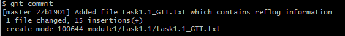

and then push it to out remote repo with `git push origin master` 

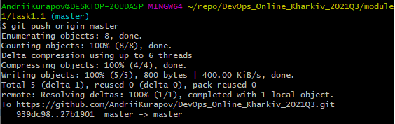
 
# Results of my work

* Learned how to do a basic git setup

* Learned how to create and manage repositories on GitHub

* Learned how to clone remote GitHub repository to local workstation

* Tried and mastered basic git commands (init, checkout, branch, commit, 
status, merge, add, log, reflog, push)

* Learned how to push all your branches at once with git push origin --all

* Learned how to solve content merge conflicts

* Learned basic syntax of markdown language 

# My opinion on DevOps

Personally for me DevOps is a culture that is designed to facilitate the 
process of creating software products by organizing and automating 
testing, development and operation processes
 
