# Task 2.1 Report
## Part 1: HYPERVISORS
### 1.1. What are the most popular hypervisors for infrastructure virtualization?
In my opinion, most popular virtualization solutions for now is VMWare Workstation and OracleVM VirtualBox.
### 1.2. Briefly describe the main differences of the most popular hypervisors
Their main difference is that VMware Workstation is a full-fledged commercial product with closed source code (the source code is open only from VMware Player - a stripped-down version of Workstation), and Oracle VirtualBox is an open source platform that runs on top of many operating systems (open source edition VirtualBox OSE).
Also, VirtualBox has next pros:
* VirtualBox is completely free!
* VMware Workstation only runs on Windows and Linux host operating systems, while VirtualBox supports Windows, Linux, Mac OS X and Solaris hosts.
* Teleportation technology that allows you to move a running virtual machine to another VirtualBox host, without having to stop it. This feature is not available in VMware Workstation
* VirtualBox has the ability to work not only with the native .VDI format, but also .VMDK and .VHD. VMware Workstation has the ability to run virtual machines only from VMDK virtual disk images (although there is a free VMware Converter product for importing virtual machines from other formats).
* VirtualBox has more options for working from the command line (managing VMs, devices, snapshots and much more)
* VirtualBox can limit CPU consumption and I / O, VMware Workstation does not (only VMware vSphere can do this)
* VirtualBox can adjust video memory
## Part 2: WORK WITH VIRTUALBOX
### 2.1 Import, export, cloning
In this part of my task, i learned how to import, export and clone existing VM with OS 
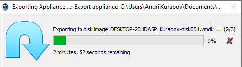
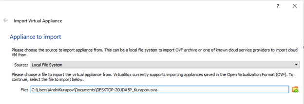
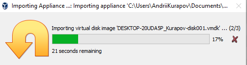
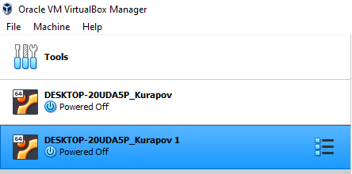
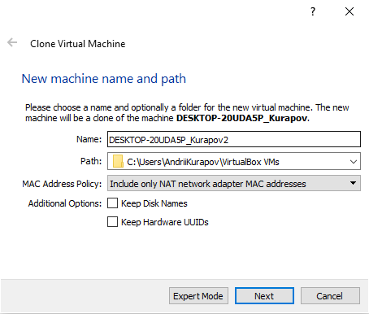
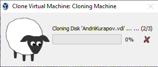 
### 2.2 Snapshots
Snapshot it's like a photo of a virtual machine (VM) at specific state. The virtual machine can be used for all sorts of experiments, or changes can be made to it, which then need to be quickly rolled back. In order not to suffer every time to restore the previous state of the VM, VirtualBox has a snapshot feature that can return VM to its original or previous state
Lets create 'test' directory, create test file with some text in it, and make a snapshot
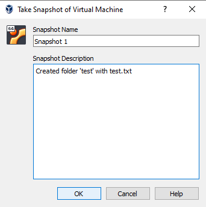

Lets delete 'test' directory and create second snapshot
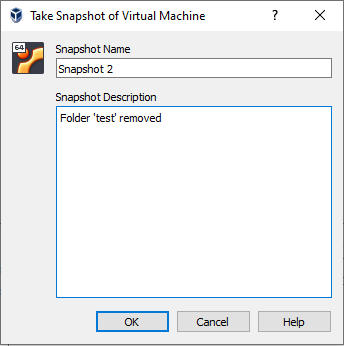

We can backup to Snapshot 1 when 'test' folder wasn't deleted.
### 2.3 USB Setup
In this part of task i tried to set up usb ports on guest machine so it can see host usb devices. I tried to make my usb flash drive visible for guest OS
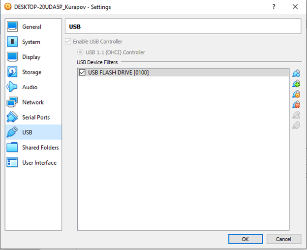
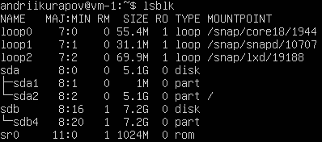
As we can see, we have new sdb4 device with 7.2GB of memory.
### 2.4 Guest Additions installation, shared folders
At first, we need to install some updates for our VM
`Sudo apt install ‘linux-headers-‘ $(uname -r) build-essential dkms`
After this, we can install guest additions
```
mount /dev/cdrom /media/cdrom
sudo /media/cdrom/VBoxLinuxAdditions.run
```
Now we can set up our shared folder
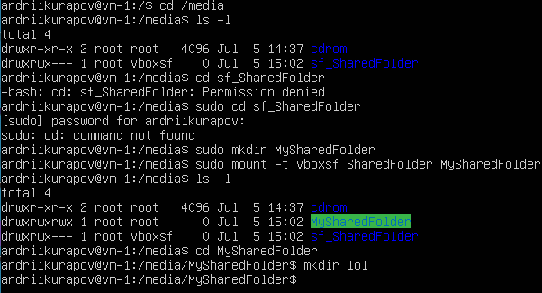

### 2.5 Networking modes
VM's network adapters have various networking modes, which i need to examine in this task:
1. Internal network mode
This can be used to create a different kind of software-based network which is visible to selected virtual machines, but not to applications running on the host or to the outside world.
An internal network, according to the [VirtualBox manual](https://www.virtualbox.org/manual/ch06.html), is "a software network that can be visible to selectively installed virtual machines, but not to applications running on a host or on remote machines located externally." Such a network is a collection of a host and several virtual machines. But none of the above devices have an output through a physical network adapter - it is completely software, used by VirtualBox as a network router. In general, the result is a private local area network only for guest operating systems without Internet access, which makes it as secure as possible. A possible use for such network type is a top-secret server with clients for development; penetration testing of systems or any other purpose aimed at creating an internal network for development teams or organizations. This is an ideal way to block your environment from unauthorized software installation, downloading or uploading files, or visiting services like Facebook during business hours.
2. Host-Only Adapter mode
Host-only networking can be thought of as a hybrid between the bridged and internal networking modes. As with bridged networking, the virtual machines can talk to each other and the host as if they were connected through a physical Ethernet switch. As with internal networking, a physical networking interface need not be present, and the virtual machines cannot talk to the world outside the host since they are not connected to a physical networking interface.
When host-only networking is used, Oracle VM VirtualBox creates a new software interface on the host which then appears next to your existing network interfaces. In other words, whereas with bridged networking an existing physical interface is used to attach virtual machines to, with host-only networking a new loopback interface is created on the host. And whereas with internal networking, the traffic between the virtual machines cannot be seen, the traffic on the loopback interface on the host can be intercepted.
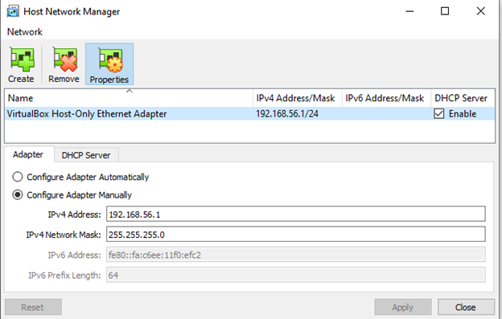
After i started VM's in this mode, i need to refresh their ip adresses via DHCP
```
sudo dhclient -r
sudo dhclient 
```
To ping host from VM I need to disable my Windows Defender firewall, or add OracleVM VirtualBox in firewall exceptions.
3. NAT mode
NAT protocol allows the guest operating system to access the Internet using a private IP that is not accessible from the outside network or to all machines on the local physical network. This network setup allows you to visit web pages, download files, view e-mail. And all this using the guest operating system. However, it is impossible from the outside to connect directly to such a system if it uses NAT.
The principle of network address translation is pretty simple. When the guest OS sends packets to a specific address of a remote machine on the network, the NAT service running under VirtualBox intercepts these packets, extracts the segments containing the sending point address (the IP address of the guest operating system) and replaces them with a host machine IP address. Then it repackages them and sends them to the specified address.
4. Bridged adapter mode
With bridged networking, Oracle VM VirtualBox uses a device driver on your host system that filters data from your physical network adapter. This driver is therefore called a net filter driver. This enables Oracle VM VirtualBox to intercept data from the physical network and inject data into it, effectively creating a new network interface in software. When a guest is using such a new software interface, it looks to the host system as though the guest were physically connected to the interface using a network cable. The host can send data to the guest through that interface and receive data from it. This means that you can set up routing or bridging between the guest and the rest of your network.
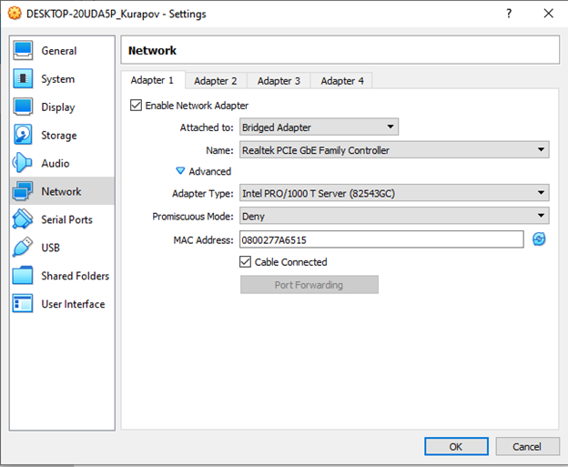
5. NAT Network mode
NAT network is a kind of local subnet, which is common for all virtual machines in its composition.
Reasoning from the point of view of using a virtual machine as a local server, the main drawback of these connection types is that they are not accessible from the outside. Because of this, some necessary functions do not work: connecting to the server via SSH, any calls to test sites.
The limitations of NAT modes can be bypassed by forwarding ports for connections or by adding a network adapter with the connection type - Virtual Host Adapter. Both methods provide inbound connections between the host system and the local server.
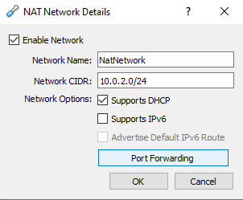
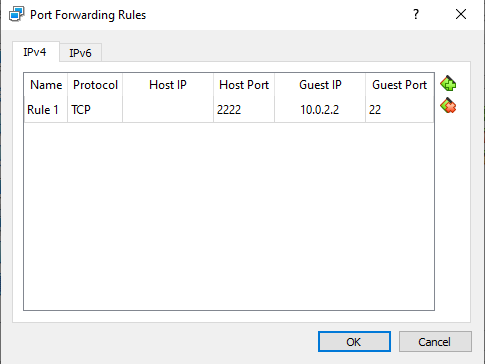
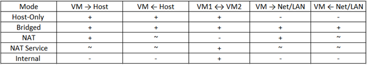
### 2.6 Work with CLI through VBoxManage
I tried basic VBoxManage commands
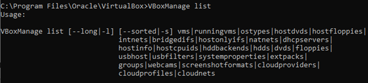
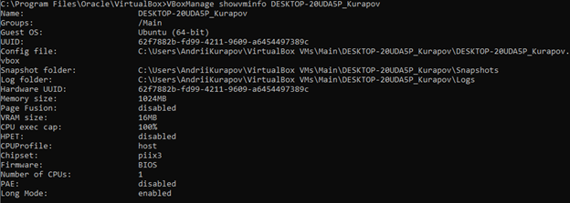
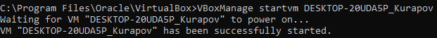
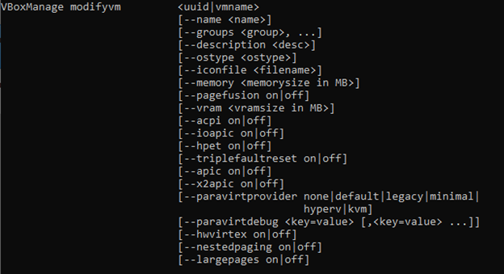
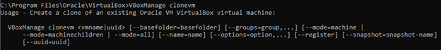
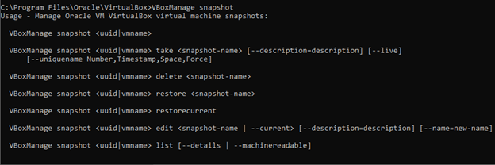
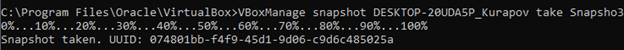
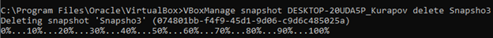
## Part 3: WORK WITH VAGRANT
### 3.1 Vagrant init and up default vagrantbox (precise64)
After Vagrant installation, i changed $PATH
`C:\Users\AndriiKurapov>set PATH=%PATH%;C:\HashiCorp\Vagrant\bin`
Then i initialized precise64 vagrantbox
```
C:\VM\VagrantVM>vagrant init /hashicorp/precise64
C:\VM\VagramtVM>vagrant up
```
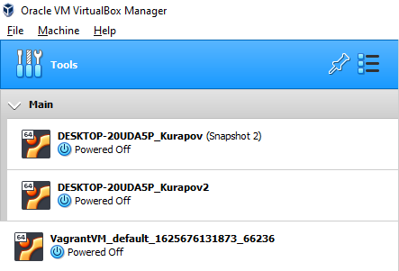
### 3.2 Connecting via PuTTy
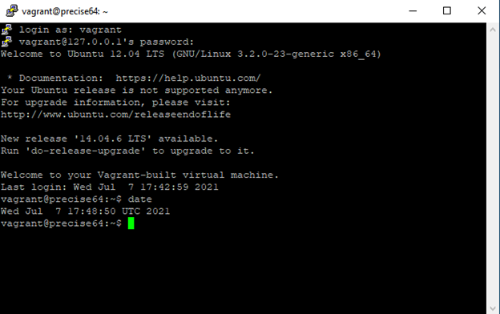
### 3.3 Create my own vagrantbox
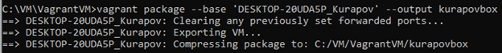
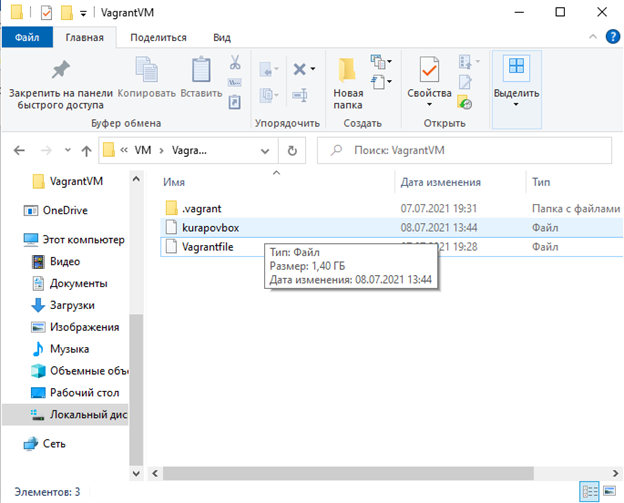
# Results of my work
1. Learned basic tools of OracleVM VirtualBox
2. Deepened my knowledge of virtualization
3. Got practical skills in setting up virtual machines (cloning, export, import, networking, etc.)
4. Deepened my knowledge about networks
5. Learned basics of vagrant
