# Task 3.1 Report
## PART 1
### 1.1 Install MySQL server on VM
### 1.2 Create database schema
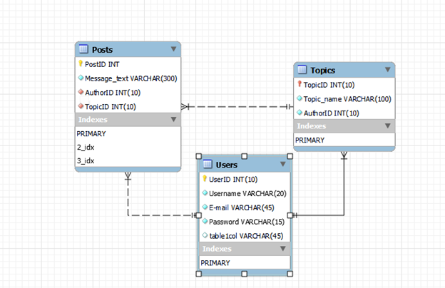
### 1.3 Create database on server via console
`create database forum`

```
Create table Users (
UserID int(10) AUTO_INCREMENT,
Name varchar (20) NOT NULL,
Email varchar (45) NOT NULL,
Password varchar (15) NOT NULL,
PRIMARY KEY (UserID)
);

Create table Topics (
TopicID int(10) NOT NULL,
TopicName varchar(100) NOT NULL,
AuthorID int(10) NOT NULL,
PRIMARY KEY (TopicID),
FOREIGN KEY (AuthorID) REFERENCES Users (UserID)
);
Create table Posts (
PostID int(10) AUTO_INCREMENT,
MessageText varchar (300) NOT NULL,
AuthorID int(10) NOT NULL,
TopicID int(10) NOT NULL,
PRIMARY KEY (PostID),
FOREIGN KEY (AuthorID) REFRENCES Users (UserID),
FOREIGN KEY (TopicID) REFERENCES Topics (TopicID)
);
```
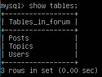
### 1.4 Fill tables
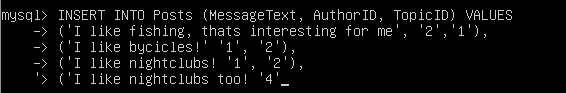

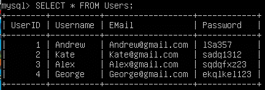

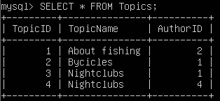

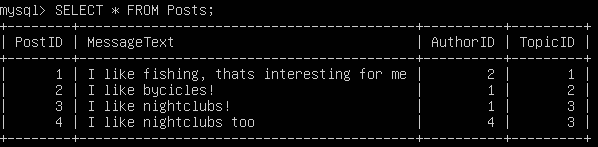
### 1.5 Construct and execute SELECT operator with WHERE, GROUP BY and ORDER BY
```
SELECT COUNT(TopicID), MessageText 
FROM Posts
WHERE TopicID=3
GROUP BY MessageText
ORDER BY MessageText;
```

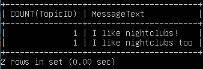
### 1.6 Execute other different SQL queries (DDL, DML, DCL)
DDL - Data Definition Language
It's a group of data definition operators. In other words, using the operators included in this group,we define the structure of the database and work with them, i.e. create, modify and delete them.
* CREATE - used to create database objects;
* ALTER - used to modify database objects;
* DROP - used to drop database objects.

DML - Data Manipulation Language
Data Manipulation Language (DML) is a group of operators for data manipulation. With the help of these operators, we can add, modify, delete and extract data from the database, i.e. manipulate them.
* SELECT - selects data;
* INSERT - adds new data;
* UPDATE - changes existing data;
* DELETE - deletes data.
Data Control Language (DCL) is a group of data access control operators. In other words, their main task is permissions management. We can allow or deny the execution of certain operations on database objects using this operators.
* GRANT - grants to user or group permissions for certain operations;
* REVOKE - revokes granted permissions;
* DENY - specifies a prohibition that has priority over permission.
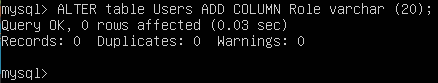

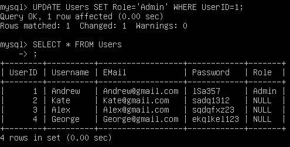

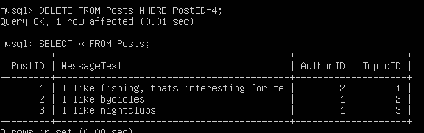
### 1.7 Create users with different privileges and verify their grants
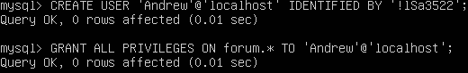 

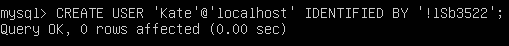

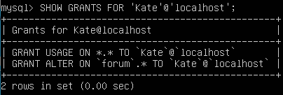

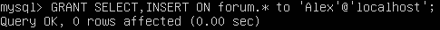

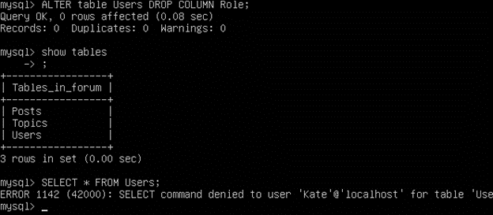

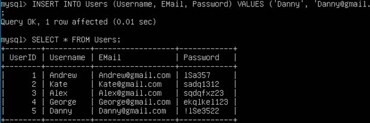


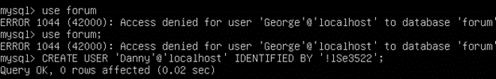
### 1.8 Make a selection from the main table DB MySQL
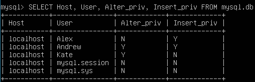 
## PART 2
### 2.1 MySQL DB backup basics
Mysqldump is a dedicated database backup utility. Dump is a file, usually with the sql extension, containing a set of sql statements (commands) for creating and filling tables in the database. 

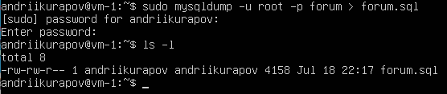

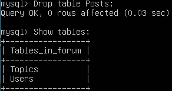

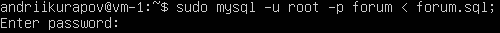

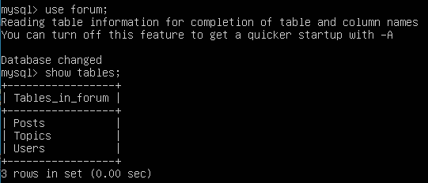
### 2.2 Transfer local database to RDS AWS, connect to DB instance, execute SELECT operator and create dump of database
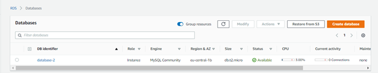

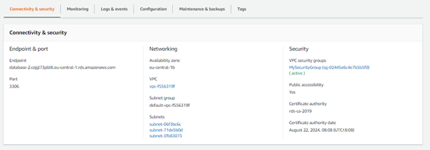

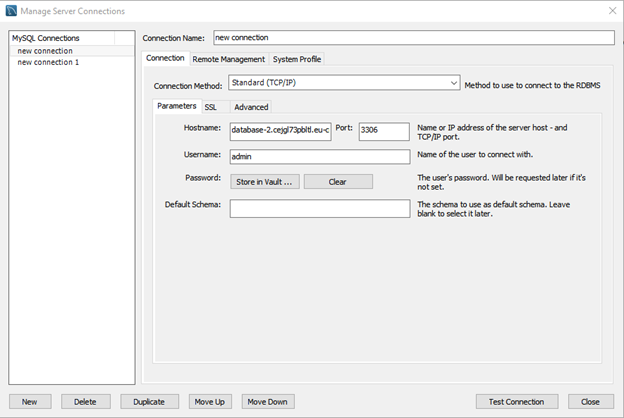

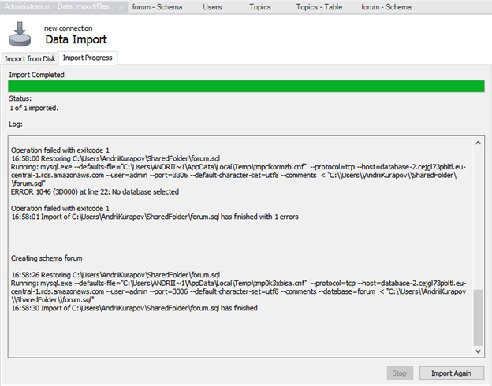

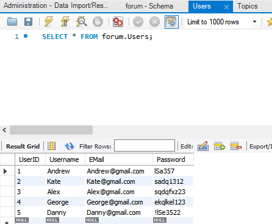

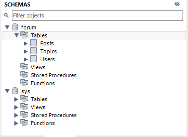

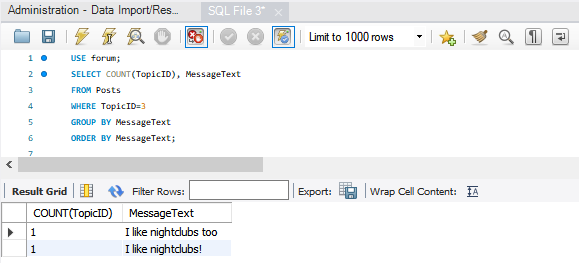


## PART 3
### 3.1 Create Amazon DynamoDB table
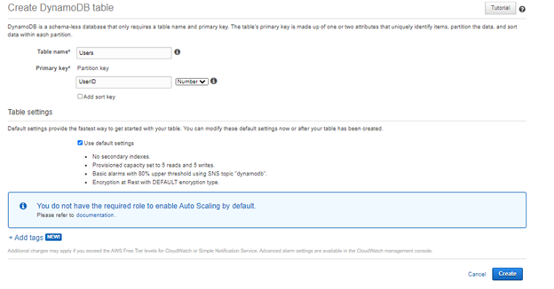
### 3.2 Enter data into Amazon DB Table
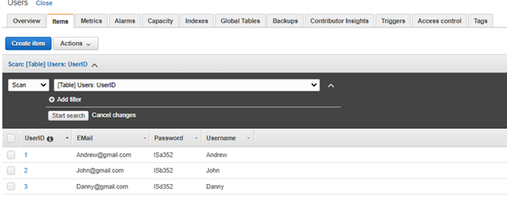
### 3.3 Query an Amazon DynamoDB table using Query and Scan
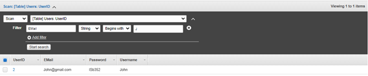

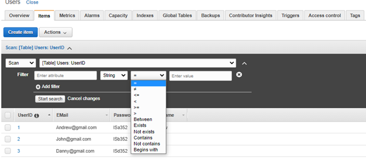

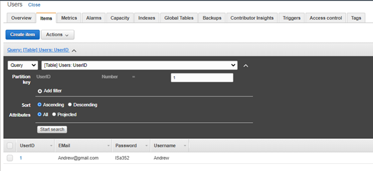

The query operation searches only for primary key attribute values and maintains a subset of comparison operators on key attribute values to refine the search process.
The scan operation scans the entire table. You can specify filters which will be applied to the results to refine the values after full scan.

